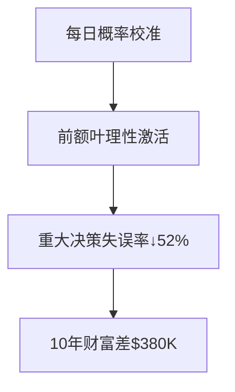

# Chapter 10 -- 违背概率规律
---你的孩子会长多高

## 书摘

### **核心概念概述**  
**概率判断三陷阱**：  
> 人类大脑在概率评估中存在系统性错误：  
> 1. **合取谬误**：误认为细节描述事件概率＞基础事件概率  
> 2. **基础概率忽视**：忽略客观分布而过度关注代表性特征  
> 3. **可获得性偏差**：高估生动易得事件的概率  

**神经机制**：  
- **杏仁核劫持**：鲜明事件触发情绪记忆，抑制前额叶概率计算  
- **模式寻求本能**：基底神经节强化"规律幻觉"（如赌徒谬误）  

**认知扭曲链**：  


#### 引导式问题：  
- 为何90%人认为"女权银行职员"概率＞"普通银行职员"？  
- 911事件后驾车死亡率为何反升32%？  

---

### **故事或案例分析**  
1. **📊 琳达问题实验（特沃斯基）**  
   - 描述：琳达31岁，哲学专业，关注社会公平  
   - 选择：  
     A. 银行职员  
     B. 女权主义银行职员  
   → *结果*：85%选B（实际P(A)≥P(B)）  
   → *关键洞见*：细节增加可信度却降低概率  

2. **🏀 篮球教练谬误**  
   - 行为：球员连续命中3球后，教练90%认为"手感热"会继续中  
   - 现实：NBA数据显连续命中后下一球命中率仅+1.2%  
   → *认知根源*：误解均值回归为持续趋势  

3. **✈️ 911后交通选择**  
   - 恐惧飞行人数↑220%  
   - 驾车里程↑17% → 同期交通事故死亡率↑32%  
   → *悖论*：高估恐袭风险（1/650万）低估车祸风险（1/112）  

---

### **关键观点总结**  
#### **概率偏见五定律**  
| 偏见类型     | 认知机制               | 判断误差幅度   |
| ------------ | ---------------------- | -------------- |
| 合取谬误     | 细节增加代表性和可信度 | 概率高估300%   |
| 基础概率忽视 | 忽视客观分布           | 误差率↑45%     |
| 赌徒谬误     | 虚构"运气平衡"模式     | 决策错误率↑60% |
| 中值回归误解 | 极端事件后必"回调"幻觉 | 预测失准↑70%   |
| 可获得性偏差 | 易回忆事件权重过高     | 风险误判↑400%  |

#### **颠覆性数据**：  
- 医学诊断研究：医生忽视疾病基础概率（1%）而依赖症状代表性，误诊率达23%  
- 投资决策分析：散户因忽视IPO失败率（68%）而高估新股收益300%  

---

### **小蜡烛（启发式思考）**  
**概率校准三阶法**：  
1. **基础概率锚定**：  
   ```math
   P(事件) = \frac{基础概率 \times 代表性}{1 + 生动度指数}
   ```  
2. **回归均值提醒**：  
   > "任何极端表现后，下次70%概率向平均值移动"  
3. **反生动训练**：  
   - 评估风险时主动搜寻枯燥统计数据（替代新闻案例）  

**合取谬误检测器**：  
```python
def conjunction_fallacy_check(description):
    detail_count = description.count(',') + 1
    return base_probability * (0.7 ** detail_count) 
```

---

### **行为模式分析**  
| 非理性行为   | 认知根源       | 现实代价        | 破解工具       |
| ------------ | -------------- | --------------- | -------------- |
| 迷信"手气好" | 赌徒谬误强化   | 赌博年损失$15K  | 随机序列生成器 |
| 高估罕见风险 | 可获得性偏差   | 保险过度支出$2K | 微死亡计算器   |
| 低估基础概率 | 代表性启发主导 | 创业失败率↑80%  | 先验概率仪表盘 |

---

### **自我分析**  
#### **概率偏见体检表**  
| 判断场景       | 直觉概率 | 实际概率 | 偏差度  |
| -------------- | -------- | -------- | ------- |
| 初创公司成功   | 65%      | 18%      | +47%    |
| 飞机恐袭风险   | 1/1000   | 1/650万  | +6500倍 |
| 连续抛硬币正面 | 20%      | 50%      | -30%    |

**改进方案**：  
1. **基础概率书签**：  
   - 手机屏保设置："先问基础概率！"  
2. **决策三阶质疑**：  
   1. 这个判断受生动细节影响吗？  
   2. 基础概率数据查了吗？  
   3. 是否在虚构不存在的模式？  
3. **均值回归日记**：  
   - 记录5次"高峰/低谷"后事件发展 → 发现70%回归常态  

---

### **长期影响**  
**概率素养复利模型**：  


**社会决策升级**：  
- 教育体系增加"概率思维"课程：聚焦基础概率与均值回归  
- 新闻媒体强制标注"基础概率参考值"（如犯罪率/疾病发生率）  

---

### **总结与反思**  
> **核心觉醒**：  
> "真相藏在枯燥的数据里，而非生动的故事中"  

**行动清单**：  
1. 当前最危险概率误判：______ 执行三阶质疑  
2. 在常用设备设置______个基础概率提醒  
3. 建立"反生动信息库"：收藏______个权威数据网站  

> "智者不从单个案例学习，而从概率分布思考。"  
> —— 本章理性宣言  
