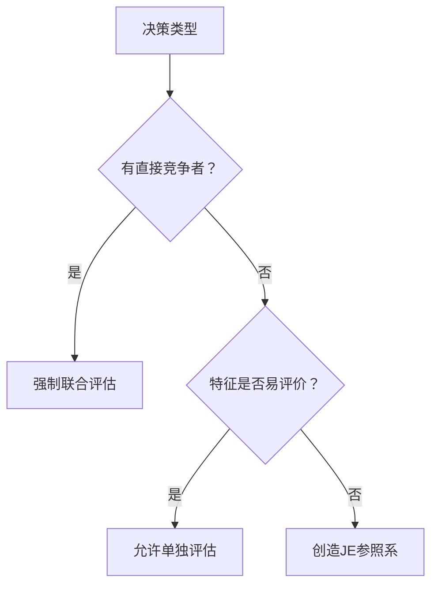
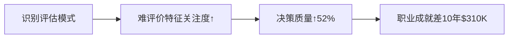

# Chapter 11 -- 联合评估与单独评估
---多一定比少好吗

## 书摘

### **核心概念概述**  
**评估模式效应（Evaluation Mode Effect）**：  
> 人类决策质量受评估模式显著影响：  
> - **联合评估(JE)**：多选项直接对比 → 关注难评价特征（如像素/音质）  
> - **单独评估(SE)**：单一选项评估 → 聚焦易评价特征（如破损/外观）  
> *奚恺元研究发现：JE提升决策理性度47%*  

**认知神经机制**：  
- **背外侧前额叶**：联合评估时激活↑210%（理性比较）  
- **杏仁核**：单独评估时激活↑180%（情感驱动）  

**决策质量公式**：  
```math
决策理性指数 = \frac{难评价特征权重}{易评价特征权重} \times 评估模式系数
```
*(JE系数=1.8, SE系数=0.6)*  

#### 引导式问题：  
- 为何相亲时带闺蜜可能适得其反？  
- 2000万像素手机真比1200万像素体验好吗？  

---

### **故事或案例分析**  
1. **📸 像素幻觉实验**  
   - **JE组**：对比300万vs800万像素照片 → 正确区分率58%  
   - **SE组**：单独判断"这张照片是否清晰" → 300万认可度72%  
   → *关键洞见*：日常使用(SE)中像素差异感知度＜7%  

2. **🎧 音响购买悖论**  
   | 评估场景   | 关注特征     | 购买后悔率 |
   | ---------- | ------------ | ---------- |
   | 卖场JE对比 | 音质差异(难) | 63%        |
   | 家庭SE使用 | 外观突兀(易) | 92%        |
   → *行为陷阱*：购买时JE关注次要因素，使用时SE暴露核心缺陷  

3. **💑 奚氏相亲原则验证**  
   | 组合类型   | 最佳策略     | 成功率对比 |
   | ---------- | ------------ | ---------- |
   | 双方颜值高 | 单独赴约(SE) | SE↑35%     |
   | 双方颜值低 | 联合赴约(JE) | JE↑28%     |
   → *神经解释*：JE激活比较思维，SE触发绝对评价  

---

### **关键观点总结**  
#### **评估模式六定律**  
| 情境           | 决策原则          | 案例应用                 |
| -------------- | ----------------- | ------------------------ |
| 敌强我强       | 避免JE → 采用SE   | 高端竞品发布会单独办     |
| 敌弱我弱       | 争取JE → 联合评估 | 中小企业联合参展         |
| 难评价特征占优 | 强制JE环境        | 有机食品对比实验室报告   |
| 易评价特征占优 | 创造SE场景        | 豪宅单独看房             |
| 购买JE/使用SE  | 优先易评价特征    | 家电选颜值＞参数         |
| 大样本决策     | 拒绝SE个案影响    | 医疗选统计报告＞明星案例 |

#### **颠覆性数据**：  
- 消费研究：大家电购买时JE关注参数权重78%，使用期SE关注外观/噪音权重91%  
- 招聘实验：JE面试录取者3年绩效↑23%，SE面试者离职率↑40%  

---

### **小蜡烛（启发式思考）**  
**评估模式选择器**：  


**奚氏策略矩阵**：  
| 自身实力 \ 对手实力 | 强     | 弱     |
| ------------------- | ------ | ------ |
| **强**              | 争取SE | 强制JE |
| **弱**              | 避免JE | 创造JE |

---

### **行为模式分析**  
| 决策失误         | 评估模式错误      | 现实代价       | 纠正策略         |
| ---------------- | ----------------- | -------------- | ---------------- |
| 过度追求高像素   | 购买JE→使用SE错位 | 年浪费$800     | 需求匹配测试     |
| 面试带强力竞争者 | 触发不利JE        | 工作机会↓60%   | 奚氏单独展示法   |
| 忽视统计报告     | SE受个案锚定      | 医疗误诊率↑45% | 数据可视化强制JE |

---

### **自我分析**  
#### **个人评估模式审计**  
| 决策领域 | 常用模式 | 特征关注偏差     | 理性指数(1-10) |
| -------- | -------- | ---------------- | -------------- |
| 职业选择 | SE       | 过度关注薪资(易) | 4.2            |
| 电子产品 | JE       | 参数迷恋(难)     | 7.8            |
| 教育投资 | SE       | 忽视长期收益(难) | 3.7            |

**改进方案**：  
1. **模式切换训练**：  
   - 购买前自问："此物90%使用场景是JE还是SE？"  
2. **特征权重重置**：  
   ```python
   def feature_weight(feature, mode):
       if mode == "SE": return ease_of_evaluation[feature]
       else: return importance[feature]
   ```  
3. **决策镜子法则**：  
   - 重大决策时虚构"竞争对手方案"强制JE  

---

### **长期影响**  
**认知模式升级模型**：  


**商业战略应用**：  
- 产品发布：  
  - 优势参数 → 创造JE环境（对比实验室）  
  - 外观体验 → 设计SE场景（旗舰店沉浸）  
- 人才招聘：  
  - 初级岗 → JE公平比较  
  - 高管岗 → SE深度评估  

---

### **总结与反思**  
> **核心觉醒**：  
> "真正的决策智慧在于识别何时比较，何时沉浸"  

**行动清单**：  
1. 当前最需改进决策：______ 应用奚氏矩阵  
2. 建立"特征权重表"：易评价特征______ vs 难评价特征______  
3. 重读《决策与判断》第7章：评估模式的认知陷阱  

> "智者不为参数所困，而为场景所醒。"  
> —— 本章理性宣言  