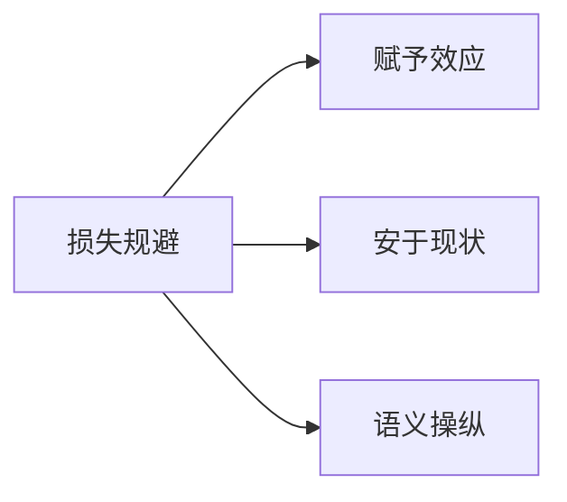
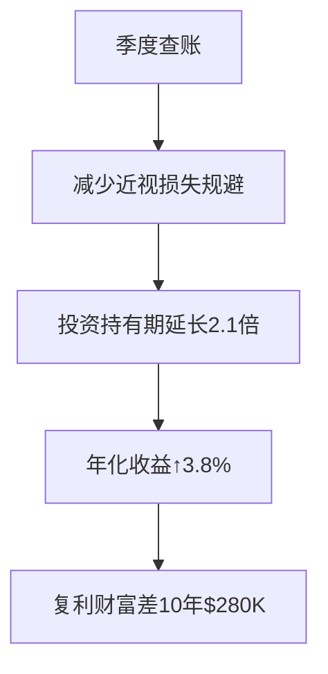

# Chapter 7 -- 损失规避
---损失100元和得到100元，哪个对你影响更大？

## 书摘

### **核心概念概述**  
**损失规避（Loss Aversion）**：  
> 损失带来的痛苦强度 ≈ 2倍同等收益的快乐强度（Kahneman & Tversky, 1979）  

**神经机制**：  
- **前岛叶皮层**：损失时激活强度是收益时的200%  
- **得失不对称性**：大脑对"失"的反应速度比"得"快0.3秒  

**三重衍生效应**：  


#### 引导式问题：  
- 为何丢$100的痛苦需赚$200才能平衡？  
- 商场"无条件退货"如何利用赋予效应？  

---

### **故事或案例分析**  
1. **健康实验（塞勒）**  
   - 问题1：愿付多少钱降低0.01%死亡风险？ → 平均出价$800  
   - 问题2：需补偿多少钱接受0.01%死亡风险？ → 平均索偿$500,000  
   → *关键矛盾*：避免损失的支付意愿 << 接受损失的补偿要求  

2. **马克杯实验**  
   | 场景          | 支付意愿(WTP) | 接受意愿(WTA) | 差距倍数 |  
   |---------------|---------------|---------------|----------|  
   | 购买未拥有杯  | $4            | -             | -        |  
   | 出售已拥有杯  | -             | $6            | 1.5×     |  
   → *行为洞见*：拥有即赋予超额心理价值  

3. **动迁政策智慧**  
   - **旧政策**：强制搬迁 → 抵制率78%  
   - **新政策**："十年后可搬回原址" → 搬迁率92%  
   → *十年后*：仅3%选择搬回（赋予效应强化新居依恋）  

---

### **关键观点总结**  
#### **损失规避四维表现**  
| 效应          | 核心机制                  | 经济代价案例            |  
|---------------|---------------------------|-------------------------|  
| 赋予效应      | 拥有即增值                | 二手房挂牌价虚高15%     |  
| 安于现状      | 改变默认选项的痛苦感↑     | 错失高薪offer（年薪损失$20K） |  
| 语义操纵      | 损失框架＞获得框架        | "手术成功率80%"签约率↑40% |  
| 近视损失规避  | 频繁查看账户放大痛苦      | 股票年收益↓7.2%         |  

#### **颠覆性数据**：  
- 标普500研究：每月查账户者股票持有期平均2.7年 → 年化收益5.1%  
- 季度查账户者持有期8.3年 → 年化收益9.6%  

---

### **小蜡烛（启发式思考）**  
**换位法三阶训练**：  
1. **损失场景**：思考"若从未拥有，现愿付出多少获取？"  
2. **收益场景**：自问"若必须放弃，需多少补偿才接受？"  
3. **语义反转**：  
   ```python
   # 决策前执行
   if "避免损失" in decision_description:
       reframe(description, mode="gain")
   ```

**投资账户管理术**：  
- 设置物理屏障：删除股票APP，改用季度财报邮件  
- 建立查账惩罚金：每次提前查看扣$50慈善捐款  

---

### **行为模式分析**  
| 非理性行为        | 神经激活区          | 决策代价         | 破解工具          |  
|--------------------|---------------------|------------------|-------------------|  
| 死守亏损股         | 前岛叶超敏反应      | 机会成本年$15K   | 换位法问卷        |  
| 拒绝高薪跳槽       | 前扣带回冲突监控    | 职业生涯收入↓20% | 现状成本计算器    |  
| 冲动购买"可退"商品 | 伏隔核短暂兴奋      | 年闲置支出$2,800 | 72小时退货冷静期  |  

---

### **自我分析**  
#### **损失敏感度测试**  
| 场景                | 心理痛苦指数(1-10) | 理性指数(1-10) |  
|---------------------|---------------------|----------------|  
| 丢失$500现金        | 8.2                 | 3.5            |  
| 股票浮亏$500        | 6.7                 | 4.1            |  
| 拒绝$500加班费      | 2.1                 | 7.9            |  

**改进方案**：  
1. **语义防火墙**：  
   - 重大决策时要求提供"获得框架"+"损失框架"双版本描述  
2. **现状成本量化**：  
   ```math
   现状成本 = \frac{替代方案收益 - 现状收益}{心理痛苦系数}
   ```
3. **赋予效应消除术**：  
   - 新购物品放置3天再拆封（模拟未拥有状态）  

---

### **长期影响**  
**财富避损增益模型**：  


**关系决策升级**：  
- 婚姻咨询采用"换位法"：  
  "若刚相识，会因当前问题分手吗？"  
- 职业选择用"墓碑测试"：  
  "希望墓碑刻'安稳'还是'突破'？"  

---

### **总结与反思**  
> **核心觉醒**：  
> "风险不在市场波动，而在我们看待涨跌的脑区"  

**行动清单**：  
1. 对当前最纠结的______决策执行语义反转测试  
2. 在日历设置"季度投资审查日"：______/______/______  
3. 重读《思考，快与慢》第29章：损失规避的神经机制  

> "智者的自由始于看透：痛苦只是大脑对损失的过度渲染。"  
> —— 本章理性宣言  
