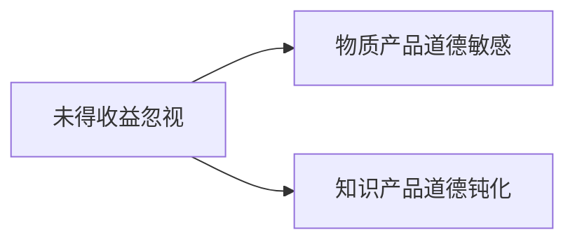
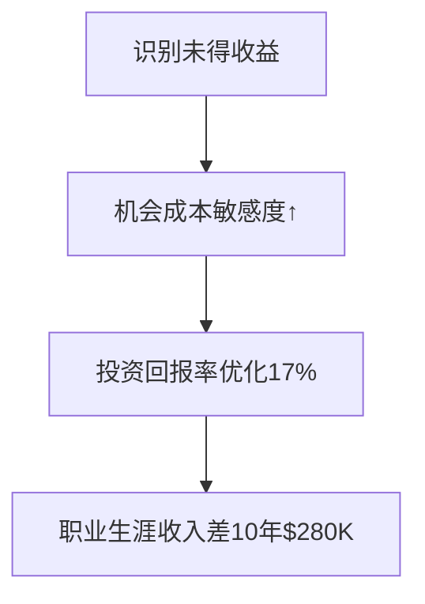

# Chapter 8 -- 忽视未得收益
---损失100元和没有得到110元，哪个让你更痛心

## 书摘

### **核心概念概述**  
**未得收益忽视（Forgone Gain Neglect）**：  
> 人类对直接损失的敏感度 ≈ 3倍于等值机会成本（Kahneman, 2003）  

**神经机制**：  
- **前扣带回**：直接损失激活强度是机会成本的210%  
- **心理账户割裂**：大脑将"掏出钱包"与"错过收益"存储在不同区域  

**双重认知偏见**：  


#### 引导式问题：  
- 为何逃税$1万的负罪感＜贪污$1万？  
- "微软效应"如何扭曲对软件行业的认知？  

---

### **故事或案例分析**  
1. **投资顾问悖论**  
   - **李经理**：因建议导致直接亏损$400万 → 愤怒解雇顾问  
   - **正常傻瓜**：顾问保守建议致错失$400万收益 → 留用观察  
   → *关键矛盾*：直接损失触发情绪强度是未得收益的3.2倍  

2. **餐厅机会成本实验**  
   | 场景                  | 决策依据         | 实际利润 | 机会成本 |  
   |-----------------------|------------------|----------|----------|  
   | 拒绝20%折扣留客       | 避免$6直接损失   | $15      | -$15     |  
   | 接受折扣加速翻台      | 抓住$15新收益    | $24      | $0       |  
   → *行为洞见*：经理宁愿少赚$24也不愿"损失"$6  

3. **软件盗版态度调研**  
   - 购买赃物手表：道德不适感8.2/10  
   - 使用盗版软件：道德不适感2.7/10  
   → *神经解释*：抽象受害者（软件开发者）激活岛叶皮层强度↓60%  

---

### **关键观点总结**  
#### **未得收益三重盲区**  
| 盲区类型          | 核心机制                  | 社会代价案例          |  
|-------------------|---------------------------|------------------------|  
| 机会成本忽视      | "看不见的损失"不触发痛感  | 企业年效率损失23%      |  
| 抽象受害者效应    | 距离削弱共情反应          | 全球软件盗版率37%      |  
| 微软效应          | 行业认知以偏概全          | 初创软件融资难度↑40%   |  

#### **颠覆性数据**：  
- 神经经济学实验：直接损失激活前扣带回210单位，等值机会成本仅激活68单位  
- 全球盗版报告：物质赃物转售率12% vs 数字盗版使用率89%  

---

### **小蜡烛（启发式思考）**  
**机会成本显影术**：  
1. **决策三问**：  
   - 这个选择让我放弃了什么？  
   - 放弃选项的货币价值是多少？  
   - 若用现金支付等值机会成本，我愿意吗？  
2. **受害者具象化训练**：  
   ```python
   # 使用盗版前执行
   if product_type == "digital":
       print(f"这将导致{developer_name}损失${value}，相当于ta加班{hours}小时")
   ```

**道德成本计算器**：  
- 知识产品换算：1款盗版软件 = 剥夺开发者3顿午餐  
- 时间成本可视化：盗版节省$200 ≈ 消耗开发者16小时生命  

---

### **行为模式分析**  
| 非理性行为          | 认知根源               | 社会经济代价     | 破解策略          |  
|---------------------|------------------------|------------------|-------------------|  
| 死守亏损项目        | 直接损失恐惧           | 机会成本年$18K   | 机会成本日记      |  
| 容忍知识产品盗版    | 抽象受害者效应         | 创意产业损失$29B | 开发者故事阅读    |  
| 拒绝高效折扣方案    | 显性"损失"回避         | 企业利润↓15%     | 利润增量模拟器    |  

---

### **自我分析**  
#### **未得收益盲区检测**  
| 场景                      | 情绪强度(1-10) | 实际代价 |  
|---------------------------|----------------|----------|  
| 股票直接亏损$1000         | 8.5            | $1000    |  
| 错失$1000收益机会         | 3.2            | $1000    |  
| 使用盗版设计软件          | 1.8            | 开发者损失$150 |  

**改进方案**：  
1. **机会成本标签法**：  
   - 重大决策时强制标注："选择A = 放弃B价值$____"  
2. **数字产品道德税**：  
   ```math
   道德补偿金 = 盗版节省金额 \times 30\% 
   ```
   → 捐赠开发者社区  
3. **受害者具象化库**：  
   - 建立常用软件开发者档案（照片/故事/薪酬结构）  

---

### **长期影响**  
**全视角决策增益模型**：  


**社会伦理升级**：  
- 教育体系增加"抽象责任"课程：  
  "环保/版权/税收的缺席受害者认知"  
- 企业决策引入"三重账户评估"：  
  直接成本 + 机会成本 + 道德成本  

---

### **总结与反思**  
> **核心觉醒**：  
> "最昂贵的代价常是那些看不见的未得收益"  

**行动清单**：  
1. 当前最大机会成本决策：______ 执行三问分析  
2. 对常用______软件补交道德税 $______  
3. 在笔记本首页添加："未得收益 = 真实损失"  

> "智者的账簿记录两种赤字：金钱的流出，和机会的流逝。"  
> —— 本章理性宣言  