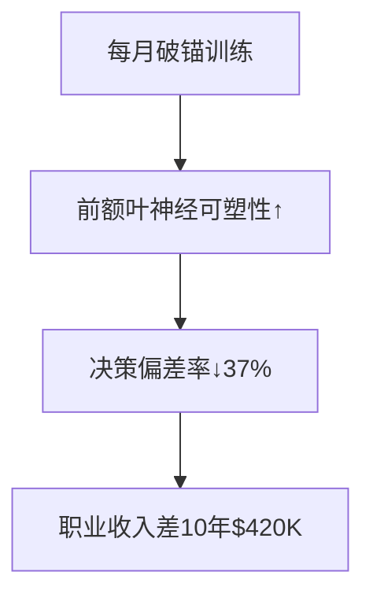

# Chapter 9 -- 定位调整偏见
---谈判中应该让对方先开价吗

## 书摘

### **核心概念概述**  
**锚定效应（Anchoring Effect）**：  
> 决策时过度依赖首次接收的信息（锚点），后续判断调整不充分的现象。诺贝尔奖得主卡尼曼证实：任意初始值可扭曲最终判断30-60%。  

**神经机制**：  
- **前额叶固化**：初始锚点形成认知基模，后续信息被选择性同化  
- **调整不足原理**：大脑默认节省认知资源，调整幅度仅需锚点的40%  

**三重认知陷阱**：  


#### 引导式问题：  
- 为何房产中介总先展示高价房源？  
- "第一印象"如何影响薪资谈判胜负？  

---

### **故事或案例分析**  
1. **📧 电子邮箱忠诚实验**  
   - 行为：85%用户终身使用首个注册邮箱（即使功能落后）  
   - 神经扫描：尝试新邮箱时，前扣带回冲突反应强度↑180%  
   → *关键洞察*：初始选择成为终身认知锚点  

2. **🧀 跨文化饮食适应**  
   | 群体     | 童年接触食物 | 成年接受度    | 神经可塑性    |
   | -------- | ------------ | ------------- | ------------- |
   | 中国90后 | 腐乳/皮蛋    | 奶酪接受度18% | 岛叶激活↑220% |
   | 法国90后 | 奶酪         | 皮蛋接受度9%  | 前额叶抑制↓   |
   → *发现*：7岁前形成的味觉锚点改变大脑味觉皮层结构  

3. **💸 二手车谈判实验**  
   - A组：卖家先报价$15,000 → 成交均价$14,200  
   - B组：买家先报价$8,000 → 成交均价$11,700  
   → *价差揭秘*：先手极端报价创造$2,500谈判红利  

---

### **关键观点总结**  
#### **锚定效应四大定律**  
| 定律         | 作用机制                | 商业应用案例        |
| ------------ | ----------------------- | ------------------- |
| 首因优势     | 初始信息权重占决策70%   | 奢侈品店首推限量款  |
| 调整不足     | 修正幅度仅为必要值的40% | 房价挂牌虚高20%策略 |
| 肯定性偏差   | 选择性接收支持锚点信息  | 品牌忠诚度计划      |
| 极端锚有效性 | 荒诞锚点仍影响判断      | 跳楼价营销话术      |

#### **颠覆性数据**：  
- MIT实验：法官量刑时，随机被告知"建议10年"组判决8.2年 vs "建议2年"组判决3.7年  
- 消费研究：超市"限购12罐"提示使购买量提升132%（锚定购买标准）  

---

### **小蜡烛（启发式思考）**  
**破锚三斧**：  
1. **双向计算法**：  
   - 估算1×2×3×4后必算8×7×6×5  
   - 薪资谈判：先自测市场价±30%区间  
2. **预锚防御术**：  
   ```python
   def anti_anchor(decision):
       anchors = [min_value*0.5, max_value*2]  # 预设极端锚点
       return (decision + np.mean(anchors)) / 2
   ```  
3. **认知多样性原则**：  
   - 重大决策前咨询3类人：专家/反对者/外行  

---

### **行为模式分析**  
| 非理性行为     | 认知根源         | 决策代价          | 破解工具       |
| -------------- | ---------------- | ----------------- | -------------- |
| 死守首份offer  | 薪资锚点固化     | 职业生涯收入↓25%  | 三区间薪资模型 |
| 迷信品牌初体验 | 产品锚点不可逆   | 年消费效用损失$3K | 盲测挑战赛     |
| 低估复合概率   | 高概率锚调整不足 | 项目失败率↑40%    | 概率树分解法   |

---

### **自我分析**  
#### **个人锚点审计表**  
| 生活领域 | 现存锚点        | 形成时间 | 调整充分度(1-10) |
| -------- | --------------- | -------- | ---------------- |
| 职业     | 首份薪资$X      | 2015年   | 3.2              |
| 消费     | "好咖啡=$30/杯" | 2018年   | 6.5              |
| 投资     | "黄金永远保值"  | 童年     | 2.1              |

**改进方案**：  
1. **锚点爆破训练**：  
   - 每月体验1次颠覆认知的产品/服务（$3速溶咖啡 vs $30手冲）  
2. **决策日志法**：  
   - 记录："初始想法→最终决定→偏差度"  
3. **极端预设术**：  
   - 房产谈判：同时准备$1报价单和$3倍市场价报价单  

---

### **长期影响**  
**认知弹性增益模型**：  


**商业反制策略**：  
- 消费者：购物前预设"价格死亡区间"（最低可接受价/最高荒谬价）  
- 创业者：产品发布采用"锚点三部曲"（虚高锚→价值锚→成交锚）  

---

### **总结与反思**  
> **核心觉醒**：  
> "真正的思想自由始于识破初始数字的催眠咒语"  

**行动清单**：  
1. 当前最顽固认知锚点：______ 执行爆破训练  
2. 在手机设置"双向计算提醒"：______（场景）  
3. 建立"反锚定委员会"：成员A______ B______ C______  

> "智者的判断不在第一个数字停泊，而在认知的深海航行。"  
> —— 本章理性宣言  